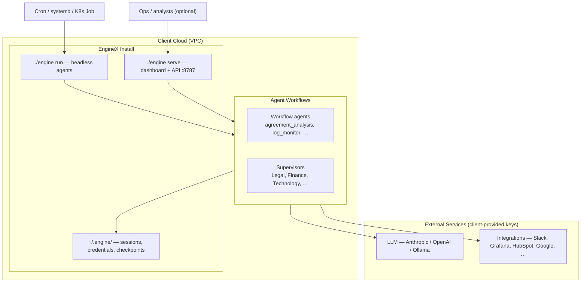
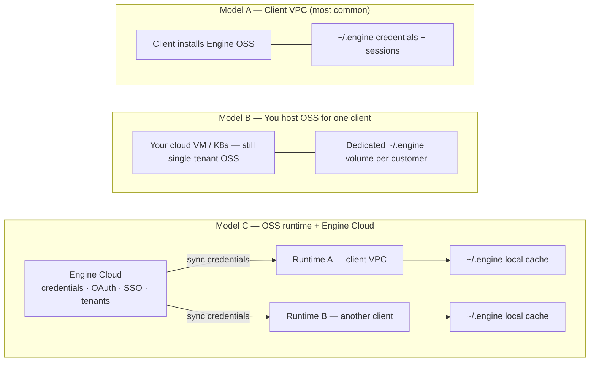
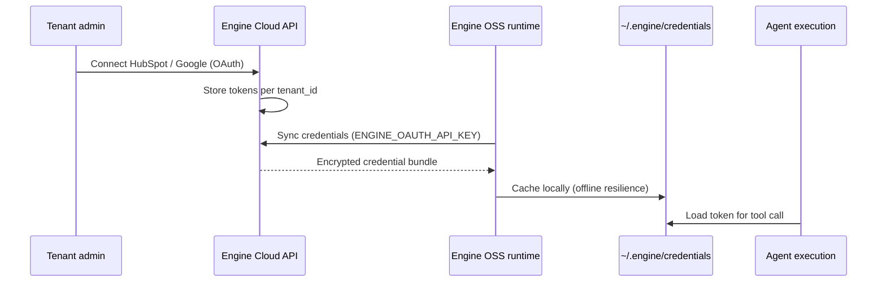
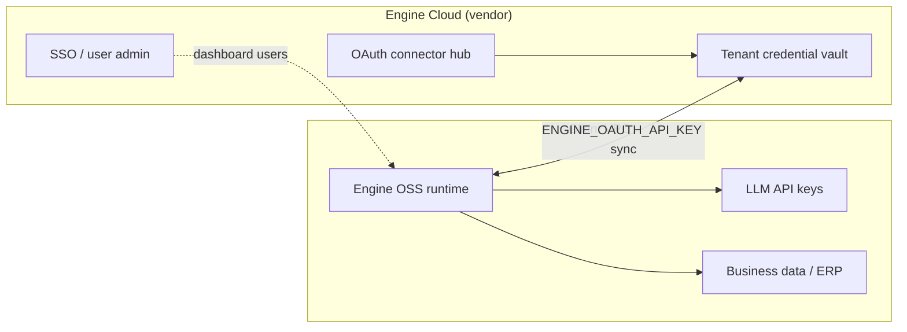
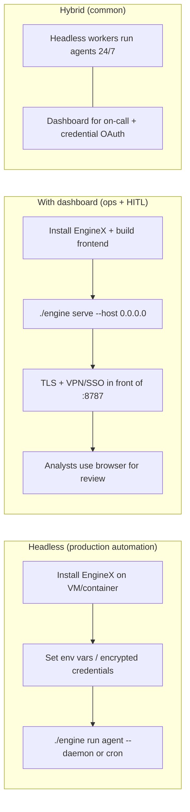
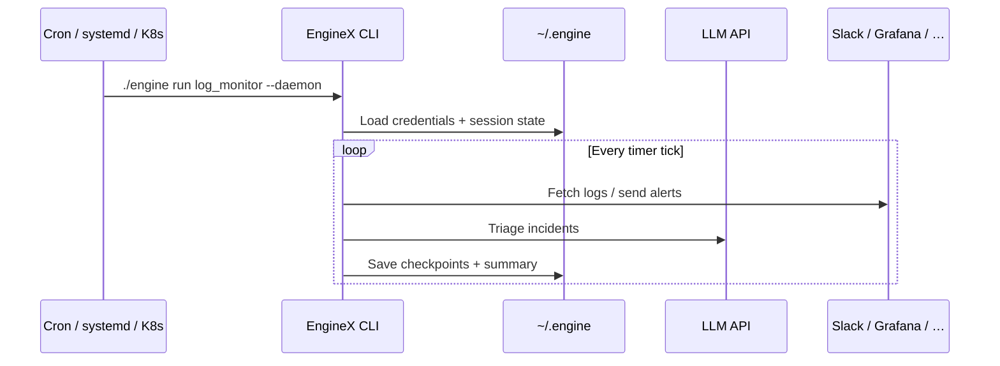
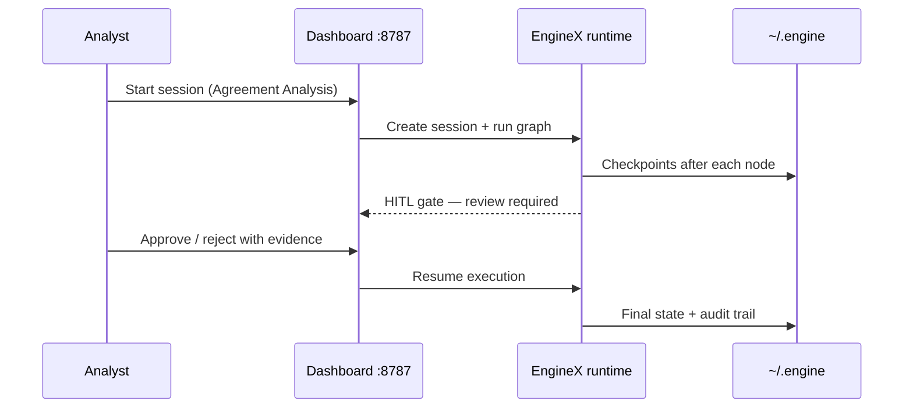
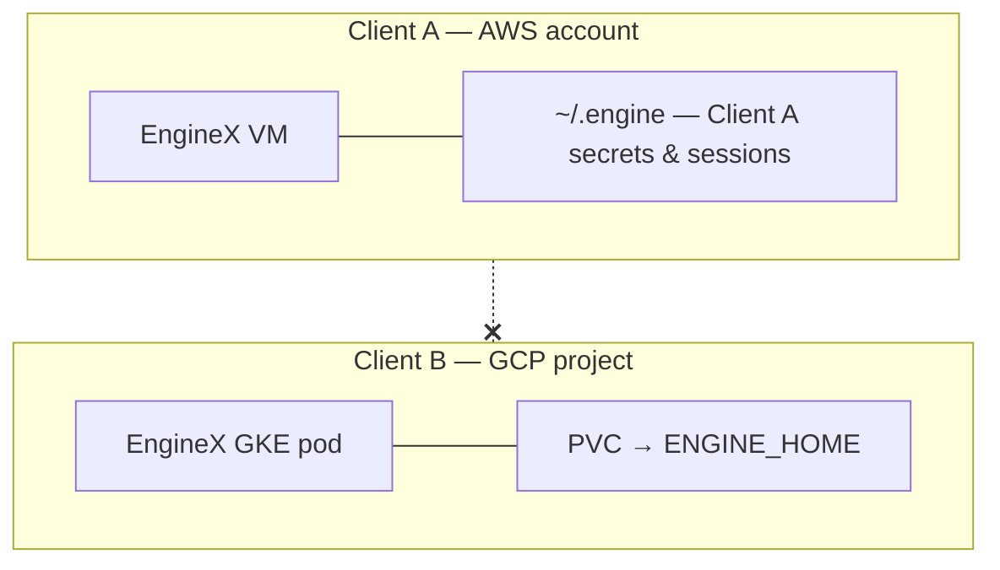
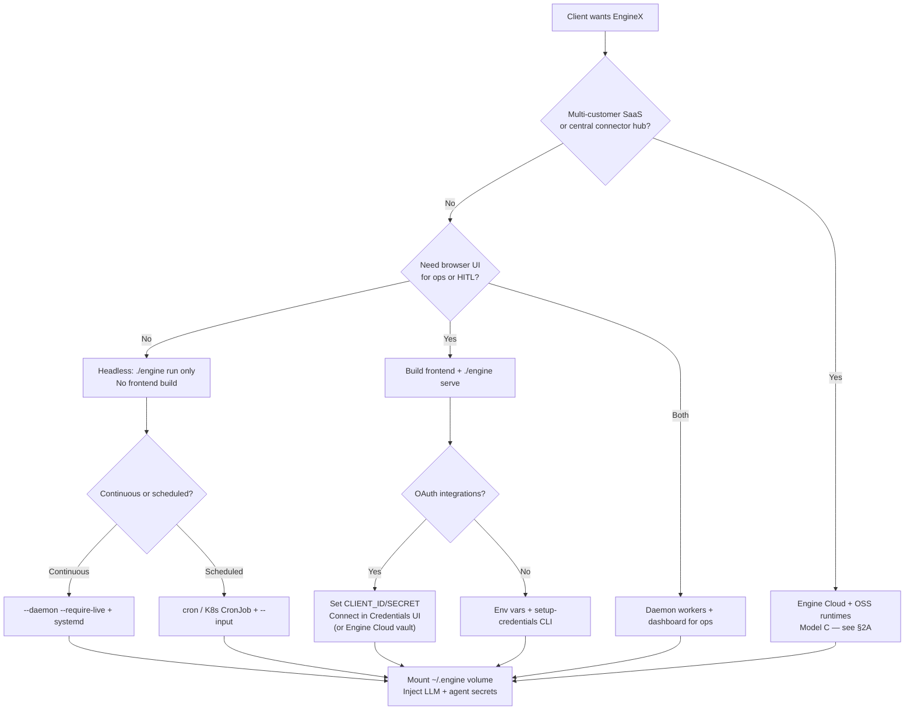

# Client Ticket: EngineX OSS — Deployment & Usage Guide

| Field | Value |
|-------|-------|
| **Product** | EngineX (Engine OSS) |
| **Repository** | [github.com/EngineXV/engineX](https://github.com/EngineXV/engineX) |
| **Audience** | Client platform / DevOps / engineering teams |
| **Deployment model** | **Engine OSS** self-hosted in client's cloud (default) · **Engine Cloud** optional hosted control plane |
| **Tenancy (OSS)** | One EngineX install = one isolated environment (no shared multi-tenant DB in OSS) |
| **Tenancy (Cloud)** | Multi-org SaaS — org-scoped credentials, users, connectors (see [EngineX #4](https://github.com/EngineXV/engineX/issues/4)) |

---

## 1. What is EngineX?

EngineX is a **two-layer product**:

| Layer | What it is | Where it runs | In public repo? |
|-------|------------|---------------|-----------------|
| **Engine OSS** | Agent runtime, CLI, dashboard, local credential vault, templates | **Client's cloud** (or your managed VM) | Yes — [EngineXV/engineX](https://github.com/EngineXV/engineX) |
| **Engine Cloud** | Hosted control plane — central credential vault, OAuth connector hub, org/tenant admin, SSO | **EngineX vendor cloud** (or your SaaS) | **No** — private; OSS has integration hooks only |

**Engine OSS** is the open-source **goal-driven agent runtime**. Clients install it to run AI workflows as **graphs** of nodes (LLM steps, tools, human approval gates, timers, supervisors).

**Engine OSS includes:**

- Agent runtime (CLI + optional web dashboard)
- Workflow templates (agreement review, log monitor, support triage, supervisors, etc.)
- Encrypted **local** credential store (`~/.engine/credentials/`)
- Checkpoints, HITL review, ops console
- MCP tool integration (Slack, Grafana, browser automation, terminal, etc.)

**Engine Cloud** is optional. Most pilots use **OSS only** in the client's VPC. See [§2A Engine Cloud](#2a-engine-cloud-optional-hosted-control-plane) for when Cloud is needed and how it connects to OSS runtimes.

---

## 2. High-Level Architecture



**Key point:** Data and secrets stay in the client's cloud. Persistence is **filesystem-based** (JSON under `~/.engine/`), not a separate database.

---

## 2A. Engine Cloud (optional hosted control plane)

### What Engine Cloud is

**Engine Cloud** is the **hosted management layer** that sits above one or more **Engine OSS runtimes**. It is **not** required to run agents. It is required when you sell **multi-customer SaaS**, a **central connector portal**, or **managed credentials across many installs**.

| Capability | Engine OSS (client/runtime) | Engine Cloud (control plane) |
|------------|----------------------------|------------------------------|
| **Run agents** | Yes — `./engine run`, `./engine serve` | No — does not execute graphs |
| **Store sessions/checkpoints** | Yes — `~/.engine/` on runtime disk | Optional central audit/history (product decision) |
| **Credential vault** | Local encrypted files per install | **Per-org / per-tenant** vault + sync to runtimes |
| **OAuth "Connect HubSpot/Google"** | Per-install dashboard + env `CLIENT_ID`/`SECRET` | Central OAuth app + token refresh for all tenants |
| **Users / SSO / RBAC** | None built-in (put proxy in front of `:8787`) | Org admin, operators, approvers |
| **Multi-tenant isolation** | **No** — one install = one client | **Yes** — tenant-scoped data (see GitHub [#4](https://github.com/EngineXV/engineX/issues/4)) |
| **Agent catalog** | Shared repo templates | Per-tenant agent registry (future) |

### Three deployment models



| Model | Who operates runtime | Who holds credentials | Engine Cloud? |
|-------|----------------------|----------------------|---------------|
| **A — Client self-host** | Client DevOps | Client (`~/.engine` or their secret manager) | **No** |
| **B — Managed single-tenant** | You (one VM per client) | Per-client volume / secrets | **No** |
| **C — SaaS / multi-tenant** | You or client runtimes | **Engine Cloud vault** + local cache on runtime | **Yes** |

**Default recommendation for first pilots:** **Model A or B** — Engine OSS only in a private VPC. No Engine Cloud build required.

### How OSS runtimes connect to Engine Cloud (when enabled)

The public repo includes **hooks only** — not the Cloud service itself:

| Hook | Purpose |
|------|---------|
| `ENGINE_OAUTH_API_KEY` | API key for runtime → Cloud credential sync |
| `CredentialStore.with_engine_sync(base_url=...)` | Pull org credentials into local encrypted cache |
| `EngineCredentialClient` / `EngineSyncProvider` | Client library (module `engine.credentials.engine` — **not in public repo**) |
| Dashboard **Connect OAuth** (OSS) | Works **without** Cloud using per-install `HUBSPOT_CLIENT_ID`, `GOOGLE_CLIENT_ID`, etc. |

**Runtime behavior with Cloud configured:**



If `ENGINE_OAUTH_API_KEY` is **unset**, OSS uses **local-only** storage — same as Model A/B.

**Code reference (OSS):** `core/engine/credentials/store.py` → `CredentialStore.with_engine_sync()`

### When clients need Engine Cloud vs OSS only

| Need | OSS only | Engine Cloud |
|------|----------|--------------|
| Single company, one VPC | **Yes** | Overkill |
| Client owns all keys in their secret manager | **Yes** | Optional |
| Headless workers, no shared login | **Yes** | No |
| Many customers on **one** hosted product (`app.you.com`) | No | **Yes** |
| Central IT connects Salesforce once for all departments/tenants | No | **Yes** |
| Enterprise SSO (Okta/SAML) for dashboard users | Proxy in front of OSS, or | **Yes** |
| Self-serve signup + billing | No | **Yes** (Phase 2+) |

### What is not in the public repo today

- Engine Cloud API service (`api.*` host)
- `engine.credentials.engine` sync client package
- Multi-tenant user/org database
- Hosted connector marketplace UI

OSS ships stubs and env vars so runtimes **can** sync when Cloud is available; pilots do not depend on it.

### Engine Cloud + client VPC (hybrid)

Common enterprise pattern:

1. **Agents run in client VPC** (data never leaves) — `./engine run` / `./engine serve`
2. **Engine Cloud** holds only **integration tokens** and **user directory** — synced down to runtime
3. **LLM keys** often stay in client VPC (env or client secret manager), not in Cloud



---

## 3. All Ways a Client Can Use EngineX

| Mode | Command | UI | Best for |
|------|---------|-----|----------|
| **Headless — one-shot** | `./engine run <agent> --input '{...}'` | None | API-triggered jobs, CI, batch processing |
| **Headless — daemon** | `./engine run <agent> --daemon --require-live` | None | 24/7 workers (e.g. log monitor polling Grafana) |
| **Headless — scheduled** | cron / systemd / K8s CronJob calling `./engine run` | None | Periodic reports, nightly triage |
| **Terminal UI (TUI)** | `./engine run <agent> --tui` | Terminal | Local dev, demos, interactive HITL in terminal |
| **Web dashboard** | `./engine serve` then browser | Web @ `:8787` | Ops monitoring, OAuth connect, HITL in browser, checkpoint resume |
| **Validate only** | `./engine validate <agent>` | None | CI gate before deploy |
| **Credential setup** | `./engine setup-credentials <agent>` | Terminal wizard | First-time secret configuration |

### Deployment pattern comparison



---

## 4. Installation

### 4.1 Prerequisites (client provides)

| Requirement | Notes |
|-------------|-------|
| **OS** | Linux VM/container recommended (macOS OK for dev) |
| **Python** | 3.11+ (managed via `uv`) |
| **Node.js** | 18+ — **only if building the web dashboard** |
| **Persistent disk** | Mount for `~/.engine` (or set `ENGINE_HOME`) |
| **Outbound network** | To LLM APIs and integration endpoints |
| **Secrets** | Injected via env file, K8s Secret, or cloud secret manager |

### 4.2 Base install (both headless and with UI)

```bash
git clone https://github.com/EngineXV/engineX.git
cd engineX
./quickstart.sh          # runs: uv sync + validate example agent
```

Or manually:

```bash
uv sync
./engine validate examples/templates/agreement_analysis
```

### 4.3 Headless install (no dashboard)

**Skip the frontend build.** Client only needs Python deps + agent path.

```bash
# 1. Configure secrets (see Section 5)
cp .env.example .env
# edit .env — at minimum ANTHROPIC_API_KEY or OPENAI_API_KEY

# 2. Optional: encrypted credential store
export ENGINE_CREDENTIAL_KEY="<fernet-key>"   # or auto-generated on first use

# 3. Validate agent
./engine validate examples/templates/log_monitor

# 4. Run headless
./engine run examples/templates/log_monitor --daemon --require-live
```

**Production service example (systemd):**

```bash
sudo cp examples/templates/log_monitor/deploy/engine-log-monitor.service /etc/systemd/system/
sudo systemctl enable --now engine-log-monitor
```

Service runs: `/opt/engine/engine run examples/templates/log_monitor --daemon --require-live`

### 4.4 Install with web dashboard (“head” / UI mode)

```bash
cd core/frontend && npm ci && npm run build && cd ../..
./engine serve --host 0.0.0.0 --port 8787
```

Open `http://<host>:8787` (put **TLS + auth proxy** in front for production).

Dashboard provides:

- Session monitoring and graph view
- Pause / resume and **checkpoint picker**
- **Credentials** page + OAuth **Connect** (HubSpot, Zoho, Google Calendar)
- **Ops console** — run history, alerts, metrics

---

## 5. Inputs the Client Must Provide

### 5.1 Required for every deployment

| Input | How to set | Purpose |
|-------|------------|---------|
| **LLM API key** | `ANTHROPIC_API_KEY` or `OPENAI_API_KEY` in env | Powers all LLM nodes |
| **Agent path** | e.g. `examples/templates/log_monitor` | Which workflow to run |
| **Persistent storage** | Volume at `~/.engine` or `ENGINE_HOME=/data/engine` | Sessions, checkpoints, credentials |

**Optional LLM alternative:** local [Ollama](https://ollama.com) — configure in `~/.engine/configuration.json` (no cloud API key).

### 5.2 Recommended for production

| Input | How to set | Purpose |
|-------|------------|---------|
| `ENGINE_CREDENTIAL_KEY` | Env or `~/.engine/secrets/credential_key` | Encrypts OAuth tokens / API keys at rest |
| Agent-specific env file | e.g. `/etc/engine/log-monitor.env` | Keeps secrets out of shell history |

### 5.2A Engine Cloud only (Model C — optional)

Skip this section for **Model A/B** (OSS-only in client VPC).

| Input | How to set | Purpose |
|-------|------------|---------|
| `ENGINE_OAUTH_API_KEY` | Issued by Engine Cloud admin | Authenticates runtime → Cloud credential sync |
| Cloud API URL | `CredentialStore.with_engine_sync(base_url=...)` | Default hook target in OSS code: `https://api.localhost` (replace in production) |
| Tenant / org ID | Cloud-side assignment | Scopes which credentials sync to this runtime |

Without these, OSS falls back to **local-only** vault (`~/.engine/credentials/`).

### 5.3 Per-agent / per-integration inputs

Clients only configure what their chosen agent uses:

| Agent / feature | Client inputs |
|-----------------|---------------|
| **log_monitor** | `GRAFANA_URL`, `GRAFANA_API_TOKEN`, `GRAFANA_DATASOURCE_UID`, `SLACK_WEBHOOK_URL`, optional PagerDuty/Jira vars |
| **agreement_analysis** | LLM key + document input (`--input` or `--input-file`) |
| **support_triage / invoice_review** | LLM key + case/invoice JSON input |
| **meeting_scheduler** | Google Calendar MCP + OAuth or token |
| **HubSpot / Zoho CRM** | `HUBSPOT_CLIENT_ID` + `HUBSPOT_CLIENT_SECRET` (dashboard OAuth) |
| **Google Calendar** | `GOOGLE_CLIENT_ID` + `GOOGLE_CLIENT_SECRET` (dashboard OAuth) |
| **Browser automation (GCU)** | Chrome extension **or** Playwright (`uv sync --extra browser`) |

Run guided setup for any agent:

```bash
./engine setup-credentials examples/templates/<agent_name>
```

### 5.4 Run-time inputs (when executing an agent)

| Flag | Example | When |
|------|---------|------|
| `--input` | `'{"message": "help with billing"}'` | Single run with JSON context |
| `--input-file` | `case.json` | Batch / pipeline trigger |
| `--model` | `anthropic/claude-sonnet-4-20250514` | Override default LLM |
| `--resume-session` | `session_20250614_…` | Continue prior session |
| `--checkpoint` | `cp_node_complete_…` | Resume from checkpoint |
| `--output` | `result.json` | Write final JSON to file |
| `--quiet` | | Machine-readable stdout only |

---

## 6. How Clients Use EngineX — End-to-End Flows

### 6.1 Headless automation flow



**Client steps:**

1. Install EngineX on a VM with persistent disk.
2. Place secrets in `/etc/engine/<agent>.env`.
3. Validate: `./engine validate examples/templates/log_monitor`.
4. Start daemon or cron job.
5. Monitor via logs, `/api/metrics` (if serve is also running), or external alerting.

### 6.2 Dashboard + human-in-the-loop flow



**Client steps:**

1. Build frontend + `./engine serve --host 0.0.0.0`.
2. Put reverse proxy with TLS and SSO/VPN in front.
3. Connect OAuth integrations on **Credentials** page (one-time).
4. Operators use **Sessions** for live runs and **Ops** for history/alerts.

### 6.3 One client = one install (isolation)



OSS does **not** partition credentials by tenant inside one install. Each client gets a **separate deployment** and **separate `~/.engine` volume** — unless you add **Engine Cloud** (§2A) for multi-tenant SaaS.

---

## 7. Shipped Workflow Templates

| Template | Headless OK? | Typical inputs |
|----------|--------------|----------------|
| `agreement_analysis` | Yes (prefer dashboard for HITL) | Document path / content |
| `log_monitor` | **Yes — `--daemon`** | Grafana + Slack env vars |
| `support_triage` | Yes | Support ticket JSON |
| `invoice_review` | Yes | Invoice JSON |
| `meeting_scheduler` | Yes | Meeting request + calendar MCP |
| `hourly_tracking` | Yes | Time-tracking context |
| `supervisors/*` | Dashboard recommended | Delegates to worker agents |
| `supervised_agreement_analysis` | Dashboard recommended | Supervisor + worker pipeline |

List and validate:

```bash
./engine validate examples/templates/<name>
./engine info examples/templates/<name>
```

---

## 8. Storage & Backup (no database)

| Path | Contents |
|------|----------|
| `~/.engine/agents/<agent>/sessions/` | Session state, logs, checkpoints |
| `~/.engine/credentials/` | Encrypted tokens and API keys |
| `~/.engine/secrets/credential_key` | Encryption bootstrap key |
| `~/.engine/configuration.json` | Default LLM provider/model |
| `~/.engine/skills/` | Custom skill documents |

**Client backup plan:** snapshot or replicate the `~/.engine` volume (or `ENGINE_HOME` mount).

---

## 9. Security Checklist for Client Cloud

- [ ] Run EngineX in a **private subnet**; restrict inbound to dashboard port via VPN/SSO proxy
- [ ] Inject secrets from **cloud secret manager**, not baked into images
- [ ] Set `ENGINE_CREDENTIAL_KEY` and rotate per environment
- [ ] Mount **persistent encrypted volume** for `~/.engine`
- [ ] Use **separate installs** per client / environment (dev vs prod)
- [ ] Enable outbound-only firewall rules where possible (LLM + known integration endpoints)

---

## 10. Quick Reference — Commands

```bash
# Setup
./quickstart.sh
cp .env.example .env

# Validate before deploy
./engine validate examples/templates/<agent>

# Headless — single run
./engine run examples/templates/agreement_analysis --input '{"file":"contract.pdf"}' --quiet

# Headless — long-running worker
./engine run examples/templates/log_monitor --daemon --require-live

# Interactive terminal
./engine run examples/templates/agreement_analysis --tui

# Web dashboard
cd core/frontend && npm ci && npm run build && cd ../..
./engine serve --host 0.0.0.0 --port 8787

# Credentials wizard
./engine setup-credentials examples/templates/<agent>
```

---

## 11. Client Decision Tree



---

## 12. Support / Handoff Checklist

When onboarding a client, collect:

1. **Product model** — OSS-only in client VPC (A), managed single-tenant (B), or OSS + Engine Cloud SaaS (C)
2. **Cloud target** — AWS / GCP / Azure / on-prem
3. **Mode** — headless, dashboard, or hybrid
4. **Agents** — which templates or custom agents
5. **LLM** — Anthropic, OpenAI, or Ollama in VPC (usually stays in client cloud even with Engine Cloud)
6. **Integrations** — Slack, Grafana, CRM, calendar, browser automation; local OAuth vs Cloud vault
7. **HITL** — who approves in dashboard vs auto-approve in headless
8. **Persistence** — volume size and backup policy for `~/.engine`
9. **Access** — how analysts reach `:8787` securely (VPN/SSO proxy, or Engine Cloud SSO)
10. **Engine Cloud** — required now or Phase 2? (see §2A)

---

## 13. Related Links

- Repository: [github.com/EngineXV/engineX](https://github.com/EngineXV/engineX)
- Log monitor production guide: `examples/templates/log_monitor/README.md`
- Integration setup: `examples/templates/integrations/README.md`
- Template index: `examples/templates/README.md`

---

*Document version: 2026-06-28 — EngineX OSS + Engine Cloud overview*
