# EngineX — Complete Product & Code Guide

> **Audience:** Business leaders, investors, and builders who want to understand EngineX — plain English, diagrams, and where it lives in code.
>
> **Product:** **EngineX** (open-source, `EngineXV/engineX`). CLI: `./engine`. Config: `~/.engine/`.

---

## Table of Contents

1. [What Is EngineX?](#1-what-is-enginex)
2. [Two Ways Clients Use It](#2-two-ways-clients-use-it)
3. [Master Anatomy Map (Structure)](#3-master-anatomy-map-structure)
4. [Master Behavioral Map (How Jobs Run)](#4-master-behavioral-map-how-jobs-run)
5. [Human Review — Full Explanation](#5-human-review--full-explanation)
6. [Three Feedback Loops](#6-three-feedback-loops)
7. [Integrations (Connectors) — Plain English](#7-integrations-connectors--plain-english)
8. [Goal vs Step Success Criteria](#8-goal-vs-step-success-criteria)
9. [Supervisor Mode](#9-supervisor-mode)
10. [Always-On / Scheduled Mode](#10-always-on--scheduled-mode)
11. [Parallel Execution](#11-parallel-execution)
12. [Code Repository Structure](#12-code-repository-structure)
13. [How an Agent Is Defined (Design Layer)](#13-how-an-agent-is-defined-design-layer)
14. [Execution Pipeline (Start to Finish)](#14-execution-pipeline-start-to-finish)
15. [Frontend Dashboard](#15-frontend-dashboard)
16. [Skills System](#16-skills-system)
17. [engine_tools Package](#17-engine_tools-package)
18. [Every Component — Business + Code Reference](#18-every-component--business--code-reference)
19. [Configuration & Data Locations](#19-configuration--data-locations)
20. [CLI Commands](#20-cli-commands)
21. [Glossary: Business Term ↔ Code Term](#21-glossary-business-term--code-term)
22. [Known Limits & Honest Gaps](#22-known-limits--honest-gaps)
23. [Investor Summary](#23-investor-summary)

---

## 1. What Is EngineX?

**EngineX is a platform that runs business workflows using AI — with people in control where it matters.**


| Chat AI | EngineX |
| --------------------- | ------------------------------------------------------- |
| Ask → get an answer   | Design a process → run jobs step by step                |
| No approval built in  | **Human review gates** with audit trail                 |
| No system updates     | **Integrations** (connectors/tools) update real systems |
| No job memory         | **Shared working file** across steps                    |
| Start over on failure | **Save & resume** mid-job                               |


**Analogy:** ChatGPT = asking a smart intern a question. EngineX = that intern following your company checklist, getting manager sign-off, updating accounting, and leaving a paper trail.

---

## 2. Two Ways Clients Use It

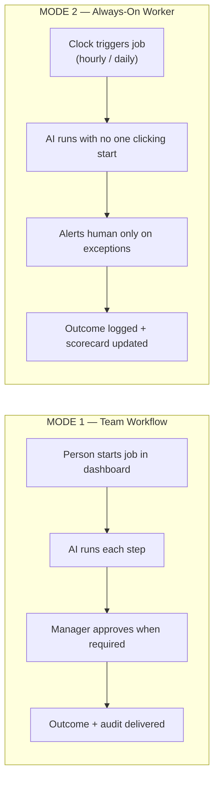


| Mode              | Who starts it | Code                                     |
| ----------------- | ------------- | ---------------------------------------- |
| **Team workflow** | Business user | `./engine run`, dashboard SessionPage    |
| **Always-on**     | Scheduler     | `--daemon`, `AsyncEntryPointSpec` timers |


Same platform. Two go-to-market motions: **interactive teams** + **unattended automation**.

---

## 3. Master Anatomy Map (Structure)

**What the product is made of — all layers and connections.**

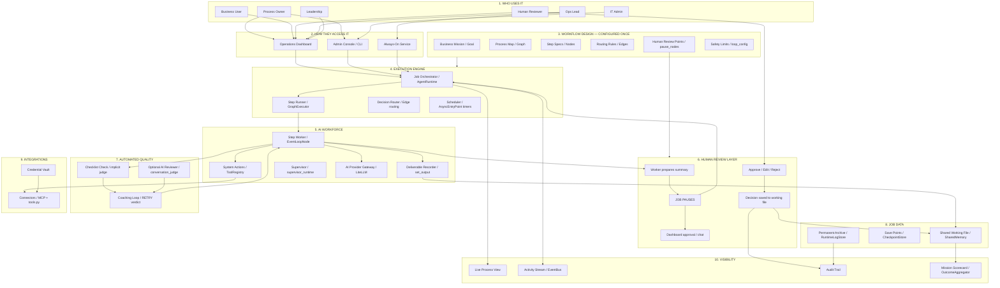


### Anatomy — box-by-box explanation

| # | Layer | Business name | What it does | Code / file |
|---|---|---|---|---|
| 1 | 1 - Who Uses It | Process Owner | Designs workflow once | `agent.py`, `nodes/`, `goal` — `examples/templates/*/agent.py` |
| 2 | 1 - Who Uses It | Business User | Starts jobs, provides input | Dashboard chat, `./engine run --input` — `SessionPage`, `runner/cli.py` |
| 3 | 1 - Who Uses It | Human Reviewer | Approves before continue | Dashboard at `pause_nodes` / `client_facing` — `ChatPanel.tsx`, `inject_input()` |
| 4 | 1 - Who Uses It | IT Admin | Connects systems | Credential setup, integrations — `credentials/`, `CredentialsPage` |
| 5 | 1 - Who Uses It | Ops Lead | Monitors 24x7 workers | Dashboard + `--daemon` — `runner/cli.py`, `AsyncEntryPointSpec` |
| 6 | 1 - Who Uses It | Leadership | Reads audit and KPIs | History, scorecards — `OutcomeAggregator`, `RuntimeLogStore` |
| 7 | 2 - Access | Dashboard | Web UI for teams | Chat, graph, sessions — `core/frontend/`, `engine/server/` |
| 8 | 2 - Access | Admin Console | CLI for power users | run, validate, serve — `./engine`, `runner/cli.py` |
| 9 | 2 - Access | Always-On | Scheduled background jobs | Timer-triggered runs — `--daemon`, `agent_runtime.py` |
| 10 | 3 - Design | Goal / Mission | Success measures + rules | Whole-job objective — `graph/goal.py` → `Goal` |
| 11 | 3 - Design | Process Map | Steps and wiring | Entry, pause, terminal — `graph/edge.py` → `GraphSpec` |
| 12 | 3 - Design | Step Specs | Per-step contract | Inputs, outputs, tools — `graph/node.py` → `NodeSpec` |
| 13 | 3 - Design | Routing Rules | Next-step logic | Success, conditional, AI decide — `EdgeSpec`, `EdgeCondition` |
| 14 | 3 - Design | Human review points | Where job must pause | Mandatory stop list — `GraphSpec.pause_nodes` |
| 15 | 4 - Execution | Job Orchestrator | Start, pause, resume, multi-job | Top-level runtime — `runtime/agent_runtime.py` |
| 16 | 4 - Execution | Step Runner | Executes one step at a time | Walks the graph — `graph/executor.py` |
| 17 | 5 - AI Workforce | Step Worker | AI on one step, multi-turn | LLM + tools loop — `graph/event_loop/node.py` |
| 18 | 5 - AI Workforce | Deliverable Recorder | Saves required facts | Synthetic `set_output` tool — `event_loop/node.py` |
| 19 | 5 - AI Workforce | System Actions | Calls integrations | Approved connectors — `runner/tool_registry.py` |
| 20 | 5 - AI Workforce | Supervisor | One chat face, pipeline behind | Department lead pattern — `tools/supervisor_runtime.py`, `examples/templates/supervisors/` |
| 21 | 5 - AI Workforce | AI Gateway | Any cloud or local model | Multi-vendor AI — `llm/litellm.py` |
| 22 | 6 - Human Review | Human Review | Pause, decide, record, resume | Full HITL path — `pause_nodes`, `inject_input` |
| 23 | 7 - Auto Quality | Auto quality | Checklist + reviewer + retry | Three feedback loops — `judge.py`, `conversation_judge.py` |
| 24 | 8 - Job Data | Working file | Shared facts per job | Cross-step memory — `SharedMemory` in `node.py` |
| 25 | 8 - Job Data | Save points | Resume after crash | Checkpoint per step — `storage/checkpoint_store.py` |
| 26 | 8 - Job Data | Archive | Permanent run history | Compliance record — `runtime/runtime_log_store.py` |
| 27 | 9 - Integrations | Credential vault | Encrypted secrets | Never in chat/logs — `credentials/store.py` |
| 28 | 9 - Integrations | Connectors | ERP, Slack, bank, etc. | Tools + MCP plugins — `tools.py`, `mcp_servers.json` |
| 29 | 10 - Visibility | Control tower | Live map, feed, audit, KPIs | Real-time visibility — `EventBus`, `GraphView.tsx` |


---

## 4. Master Behavioral Map (How Jobs Run)

**Motion — what happens from submit to outcome.**

### 4A. End-to-end job lifecycle

**Business example:** Vendor invoice → extract → human review → post to ERP.

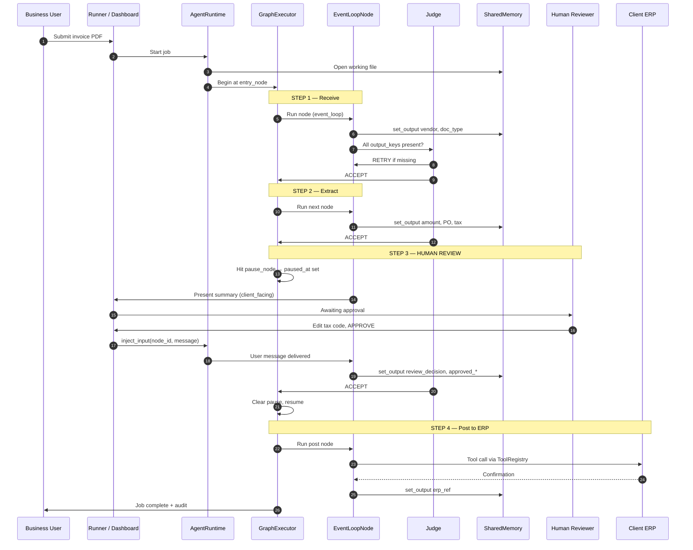


### 4B. Bird's-eye behavioral flow

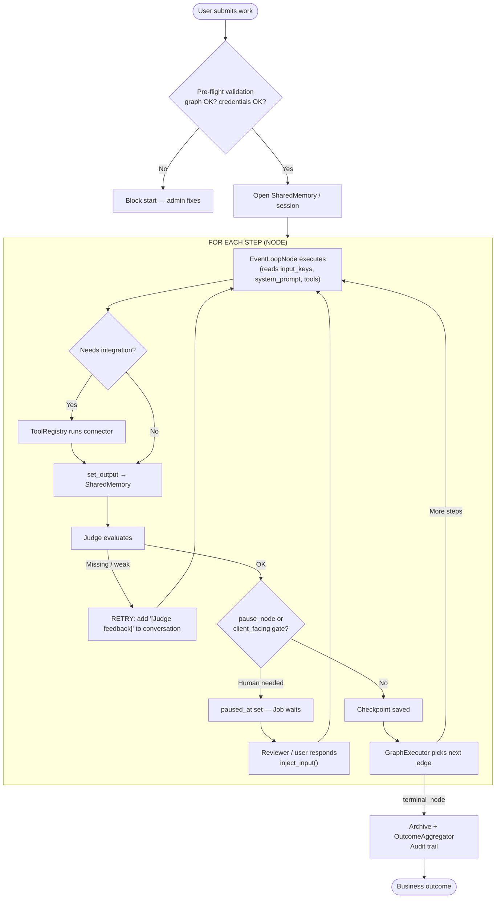


### 4C. Behavioral ↔ code mapping


| What happens (business) | What runs (code)                                               |
| ----------------------- | -------------------------------------------------------------- |
| User submits work       | `AgentRunner.run()` / `SessionManager` via dashboard           |
| Pre-flight check        | `preload_validation.py`, `graph.validate()`                    |
| Job starts              | `AgentRuntime.start()` → `ExecutionStream.execute()`           |
| One step runs           | `GraphExecutor` calls `EventLoopNode.execute()`                |
| AI thinks multi-turn    | Loop inside `event_loop/node.py` (LLM stream + tools)          |
| Facts saved             | `set_output` → `OutputAccumulator` → `SharedMemory`            |
| Auto quality check      | `_evaluate()` implicit judge in `event_loop/node.py`           |
| Optional quality AI     | `conversation_judge.evaluate_phase_completion()`               |
| Coaching note           | `conversation.add_user_message("[Judge feedback]: ...")`       |
| Job pauses for human    | `ExecutionResult.paused_at`, `GraphSpec.pause_nodes`           |
| Human replies           | `AgentRuntime.inject_input()` → `EventLoopNode.inject_event()` |
| Next step chosen        | `EdgeSpec.should_traverse()` in `graph/edge.py`                |
| Job completes           | `terminal_nodes` reached, `RuntimeLogStore` writes archive     |


---

## 5. Human Review — Full Explanation

**Human review is a first-class product feature — not buried in "quality."**

### 5A. Two ways humans interact


| Type                  | Business meaning                      | Code flags                         | Behavior                                                   |
| --------------------- | ------------------------------------- | ---------------------------------- | ---------------------------------------------------------- |
| **Approval Gate**     | Job **stops** until manager signs off | `pause_nodes` in `GraphSpec`       | `GraphExecutor` sets `paused_at`, waits for `inject_input` |
| **Conversation Step** | Worker **asks** user for info         | `client_facing=True` on `NodeSpec` | Worker uses `ask_user` or chat; blocks until input         |


### 5B. Human review state machine

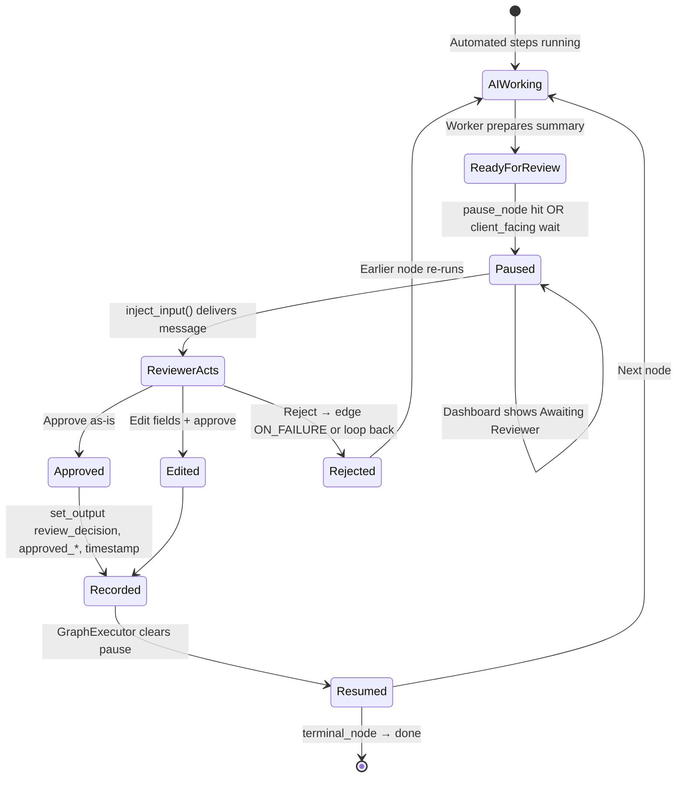


### 5C. Human review — code path

```
Dashboard ChatPanel
  → server/session.py → SessionManager
  → AgentRuntime.inject_input(node_id, text, is_client_input=True)
  → ExecutionStream.inject_input()
  → EventLoopNode.inject_event()  [puts message on _injection_queue]
  → conversation.add_user_message(content, is_client_input=True)
  → Worker LLM sees user message on next turn
  → Worker calls set_output for approval fields
  → Judge ACCEPT → GraphExecutor moves to next node
```

**Key files:**

- `core/engine/server/session.py` — dashboard → runtime bridge
- `core/engine/runtime/agent_runtime.py` — `inject_input()`
- `core/engine/graph/event_loop/node.py` — `inject_event()`, client-facing loop
- `core/engine/graph/edge.py` — `GraphSpec.pause_nodes`
- `core/engine/graph/executor.py` — pause/resume, `paused_at` in session state
- `core/frontend/src/components/ChatPanel.tsx` — reviewer UI

---

## 6. Three Feedback Loops

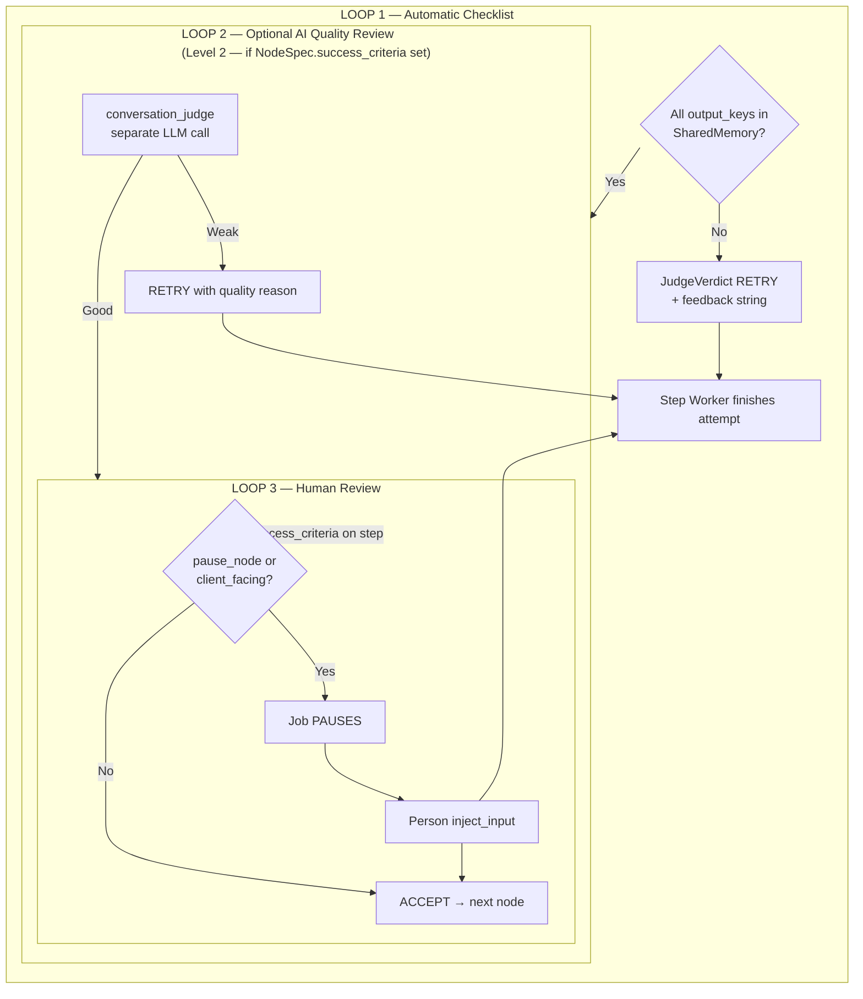


| Loop                | Who gives feedback | Code                              | Who fixes                         |
| ------------------- | ------------------ | --------------------------------- | --------------------------------- |
| **1 — Checklist**   | Platform rules     | `_evaluate()` when `missing_keys` | Same `EventLoopNode`, RETRY       |
| **2 — AI reviewer** | Second LLM         | `conversation_judge.py`           | Same worker, RETRY                |
| **3 — Human** | Real person | `inject_input()` | Same worker saves approved values |


**How worker "improves":** On RETRY, feedback is added as a user message (`[Judge feedback]: ...`). The same LLM on the next turn reads history + feedback and calls `set_output` again. No separate "fixer" program.

**Judge verdicts** (`graph/event_loop/judge.py`):

- `ACCEPT` — step done, go to next node
- `RETRY` — try again same step with feedback
- `ESCALATE` — rare; production human escalation uses `pause_nodes` instead

---

## 7. Integrations (Connectors)

**Integrations = connectors = tools.** Three names, same thing: **approved ways for the AI worker to read from or write to your other systems.**

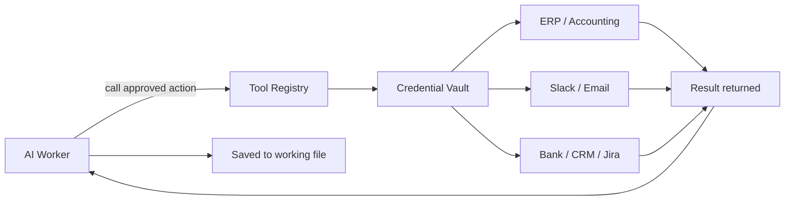


| Term                 | Meaning                                                           |
| -------------------- | ----------------------------------------------------------------- |
| **Integration** | EngineX connected to an external system (business language) |
| **Connector / tool** | The specific approved action (e.g. `notify_slack`, `post_to_erp`) |
| **MCP plugin**       | Standard plug-in format for connectors                            |
| **Credential vault** | Secure storage for logins — never exposed in chat                 |


### Three ways integrations are added


| Method             | Business                        | Code                                        |
| ------------------ | ------------------------------- | ------------------------------------------- |
| **Custom actions** | Built for one client's workflow | Agent folder `tools.py` + `@tool` decorator |
| **MCP plugins**    | Reusable standard connectors    | `mcp_servers.json` + `runner/mcp_client.py` |
| **Shared library** | Platform-wide data tools        | `tools/engine_tools/` package               |


### What EngineX provides vs what you build


| EngineX provides | Client / builder provides |
| ------------------------------------------- | -------------------------------------------- |
| Worker can **call** approved integrations   | The actual ERP/bank/Slack connection code    |
| **Credential vault**                        | API keys, OAuth, system access               |
| **Tool registry** (what's allowed per step) | Which systems this workflow may touch        |
| Saves result + audit                        | Business rules (when to post, when to alert) |


**Honest note:** EngineX is the **runtime** for integrations — not a pre-built catalog of 500 enterprise connectors. You plug in custom tools, MCP servers, or build connectors.

---

## 8. Goal vs Step Success Criteria

**Common confusion — two different checklists at two different levels.**

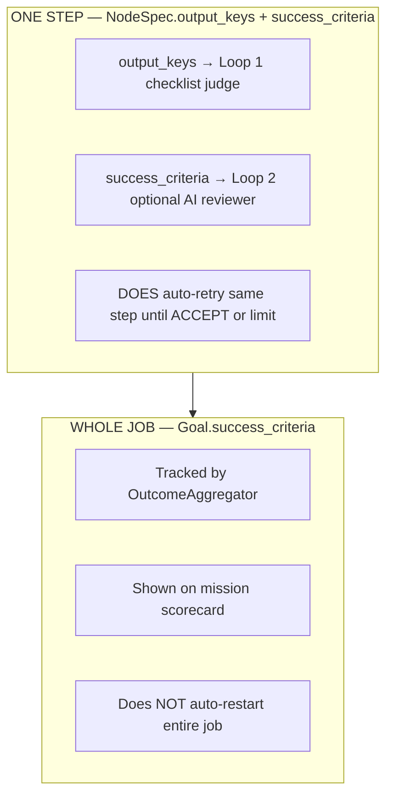


| Level            | Business                                     | Code                                         | Auto-retry?                    |
| ---------------- | -------------------------------------------- | -------------------------------------------- | ------------------------------ |
| **Whole job**    | "Was the entire mission successful?"         | `Goal.success_criteria`, `OutcomeAggregator` | **No** — tracked for reporting |
| **One step**     | "Did this step deliver everything required?" | `NodeSpec.output_keys`                       | **Yes** — coaching loop        |
| **Step quality** | "Is this step's work good enough?"           | `NodeSpec.success_criteria` (optional)       | **Yes** — if configured        |


---

## 9. Supervisor Mode

**One conversational front door full multi-step pipeline runs behind it.**

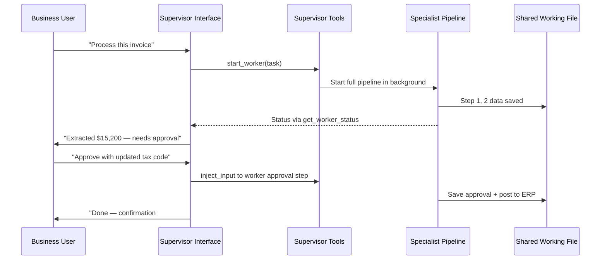


| Component           | Code                                              |
| ------------------- | ------------------------------------------------- |
| Supervisor persona  | `NodeSpec` with department-tuned prompt           |
| Lifecycle tools     | `register_queen_tools()` in `queen_supervisor.py` |
| `start_worker`      | Spawns worker graph via `AgentRuntime.trigger()`  |
| `get_worker_status` | Checks waiting nodes, active streams              |
| Worker graph        | Separate `GraphSpec` loaded at session setup      |


---

## 10. Always-On / Scheduled Mode

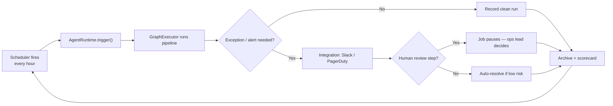


| Business          | Code                                             |
| ----------------- | ------------------------------------------------ |
| Timer entry point | `AsyncEntryPointSpec` in `GraphSpec`             |
| Headless run      | `./engine run <agent> --daemon`                  |
| Fire on schedule  | `AgentRuntime` timer tasks in `agent_runtime.py` |


---

## 11. Parallel Execution

When one step splits into independent branches (e.g. process 3 documents at once):

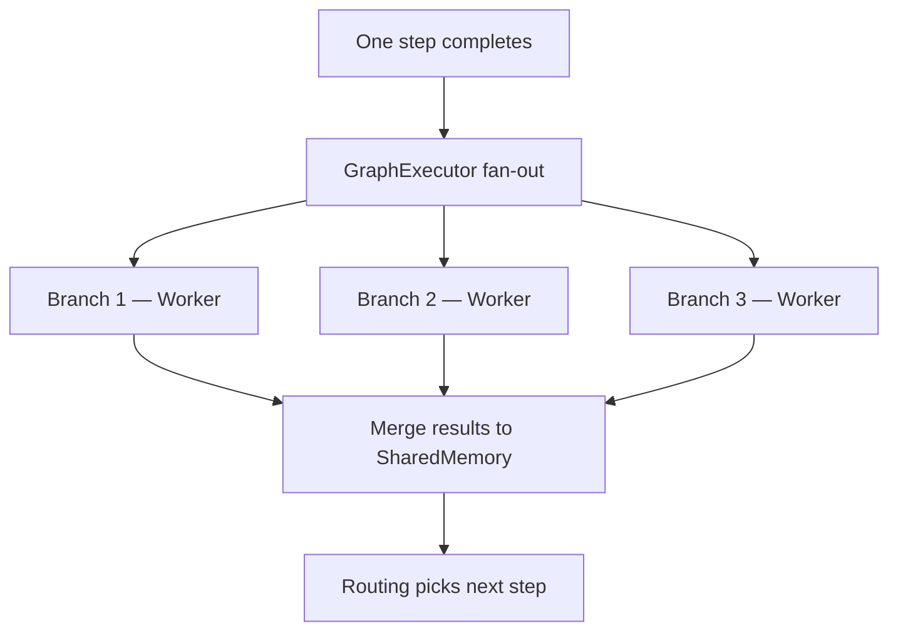


| Business          | Code                                                |
| ----------------- | --------------------------------------------------- |
| Parallel branches | `GraphExecutor` + `ParallelBranch` in `executor.py` |
| Conflict policy   | `ParallelExecutionConfig.memory_conflict_strategy`  |
| Failure policy    | `on_branch_failure`: fail_all / continue_others     |


---

## 12. Code Repository Structure

```
engine/                              ← repo root (EngineX)
├── engine                             ← CLI entry script (./engine run ...)
├── core/engine/                       ← main runtime package
│   ├── graph/                         ← WORKFLOW DESIGN + EXECUTION
│   │   ├── goal.py                    ← Goal, SuccessCriterion, Constraint
│   │   ├── node.py                    ← NodeSpec, SharedMemory, NodeContext
│   │   ├── edge.py                    ← EdgeSpec, GraphSpec, EdgeCondition
│   │   ├── executor.py                ← GraphExecutor (runs steps, HITL pause)
│   │   ├── event_loop/
│   │   │   ├── node.py                ← EventLoopNode (AI worker loop)
│   │   │   ├── judge.py               ← JudgeVerdict, JudgeProtocol
│   │   │   └── config.py              ← LoopConfig, OutputAccumulator
│   │   ├── conversation_judge.py      ← Level 2 quality reviewer AI
│   │   ├── conversation.py            ← NodeConversation (chat history)
│   │   ├── validator.py               ← Output validation
│   │   └── hitl.py                    ← Approval types for CLI
│   ├── runtime/                       ← JOB ORCHESTRATION
│   │   ├── agent_runtime.py           ← AgentRuntime (multi-stream, timers)
│   │   ├── execution_stream.py        ← ExecutionStream, inject_input
│   │   ├── outcome_aggregator.py      ← Mission scorecard
│   │   ├── event_bus.py               ← Real-time events → UI
│   │   └── shared_state.py            ← Cross-stream shared state
│   ├── runner/                        ← CLI + LOADING
│   │   ├── cli.py                     ← run, validate, info, serve, tui
│   │   ├── runner.py                  ← AgentRunner (load, setup, run)
│   │   ├── loader.py                  ← Parse agent.py exports
│   │   ├── tool_registry.py           ← Integrations + MCP discovery
│   │   ├── preload_validation.py      ← Pre-flight checks
│   │   └── mcp_client.py              ← MCP protocol client
│   ├── server/                        ← WEB DASHBOARD API
│   │   ├── app.py                     ← aiohttp app factory
│   │   ├── session.py                 ← SessionManager, inject_input bridge
│   │   └── routes.py                  ← REST + SSE endpoints
│   ├── credentials/                   ← SECURE VAULT
│   │   ├── store.py                   ← CredentialStore
│   │   └── storage.py                 ← Encrypted file storage
│   ├── llm/                           ← AI PROVIDER GATEWAY
│   │   ├── provider.py                ← LLMProvider interface
│   │   └── litellm.py                 ← LiteLLM (multi-vendor)
│   ├── storage/                       ← PERSISTENCE
│   │   ├── checkpoint_store.py        ← Save points
│   │   └── session_store.py           ← Session directories
│   ├── skills/                        ← SKILL.md discovery
│   │   └── discovery.py
│   ├── tools/
│   │   └── supervisor_runtime.py      ← Supervisor lifecycle tools
│   ├── observability/                 ← Ops metrics, run history
│   ├── server/                        ← Dashboard API (OAuth, checkpoints, ops)
│   └── tui/                           ← Terminal dashboard (Textual)
├── core/frontend/                     ← React dashboard
├── tools/                             ← engine_tools (shared integration tools)
└── examples/templates/                ← Pre-built workflow packages
```

---

## 13. How an Agent Is Defined (Design Layer)

Every deployable workflow is a folder with `**agent.py**` exporting four things:


| Export  | Business name    | Code type        | Purpose                                    |
| ------- | ---------------- | ---------------- | ------------------------------------------ |
| `goal`  | Business Mission | `Goal`           | Success criteria, constraints, description |
| `nodes` | Step catalog     | `list[NodeSpec]` | Each step's instructions, inputs, outputs  |
| `edges` | Routing rules    | `list[EdgeSpec]` | How steps connect                          |
| `graph` | Process map      | `GraphSpec`      | Entry, pause, terminal, limits             |


### 13A. Goal (Business Mission) — `graph/goal.py`


| Field                | Business meaning                                                 |
| -------------------- | ---------------------------------------------------------------- |
| `description`        | What the whole job is for                                        |
| `success_criteria[]` | Weighted checklist for **whole job** (tracked, not auto-restart) |
| `constraints[]`      | Hard/soft rules ("never fabricate data")                         |


### 13B. NodeSpec (One Step) — `graph/node.py`


| Field                        | Business meaning                                |
| ---------------------------- | ----------------------------------------------- |
| `input_keys` / `output_keys` | Reads from / must deliver to working file       |
| `system_prompt`              | Instructions for AI worker this step            |
| `client_facing`              | Talks to user in dashboard chat                 |
| `success_criteria`           | Optional Level 2 quality standard (reviewer AI) |
| `tools`                      | Which integrations this step may use            |


### 13C. EdgeSpec (Routing) — `graph/edge.py`


| EdgeCondition | Business meaning                              |
| ------------- | --------------------------------------------- |
| `ON_SUCCESS`  | Go next if step succeeded                     |
| `ON_FAILURE`  | Go next if step failed (e.g. rejection path)  |
| `CONDITIONAL` | Go if expression true (e.g. `amount > 10000`) |
| `ALWAYS`      | Always go (supervisor loop)                   |
| `LLM_DECIDE`  | AI picks next step from context               |


### 13D. GraphSpec (Process Map) — `graph/edge.py`


| Field                | Business meaning                    |
| -------------------- | ----------------------------------- |
| `entry_node`         | Where job starts                    |
| `terminal_nodes`     | Where job is "done"                 |
| `pause_nodes` | Steps that pause for human review |
| `loop_config`        | Max retries, token limits per step  |
| `async_entry_points` | Timers / always-on triggers         |


---

## 14. Execution Pipeline (Start to Finish)

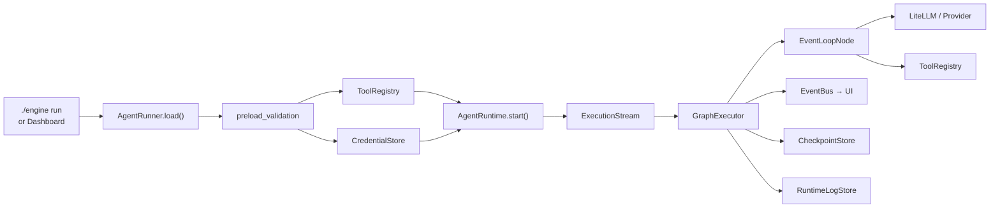


**Step-by-step (code order):**

1. `./engine run <agent>` → `runner/cli.py` → `AgentRunner.load(agent_path)`
2. Load → imports `agent.py` → gets `goal`, `nodes`, `edges`, `graph`
3. Validate → `preload_validation.run_preload_validation()` + credential check
4. Tools → `ToolRegistry.load_from_agent()` — `tools.py` + `mcp_servers.json`
5. Runtime → `create_agent_runtime()` → `AgentRuntime.start()`
6. Execute → `ExecutionStream.execute()` → `GraphExecutor.run(graph, goal)`
7. Per node → `EventLoopNode.execute()` — LLM loop + judge
8. Pause → `pause_nodes` hit → `ExecutionResult(paused_at=...)`
9. Resume → `inject_input()` → continue node → next edge
10. Done → `terminal_nodes` + `OutcomeAggregator` updates scorecard

---

## 15. Frontend Dashboard

**Path:** `core/frontend/`


| Page / component | Business purpose                   | Route / file                           |
| ---------------- | ---------------------------------- | -------------------------------------- |
| **Welcome**      | Pick agent, start session          | `/` — `WelcomePage.tsx`                |
| **Session**      | Live job: chat + graph + pause/resume + checkpoints | `/session/:id` — `SessionPage.tsx`, `CheckpointPanel.tsx` |
| **Graph View**   | Live workflow map                  | `GraphView.tsx`, `graphLayout.ts`      |
| **Chat Panel**   | User and worker chat               | `ChatPanel.tsx`                        |
| **HITL Review**  | Evidence cards + audit for approvers | `HitlReviewPanel.tsx`, `graph/hitl_evidence.py` |
| **Credentials**  | IT admin manages integrations + OAuth Connect | `/credentials` — `CredentialsPage.tsx`, `routes_oauth.py` |
| **Ops Console**  | Run history, alerts, metrics       | `/ops` — `OpsPage.tsx`, `routes_ops.py` |
| **Skills**       | Browse agent guidance docs         | `/skills` — `SkillsPage.tsx`           |
| **Org Chart**    | Supervisor / department view       | `/org-chart` — `OrgChartPage.tsx`      |
| **Sidebar**      | Navigation                         | `Sidebar.tsx`                          |


**API layer:** `core/frontend/src/api.ts` → `engine/server/routes.py` (REST + SSE)

**Start dashboard:** `./engine serve` → [http://127.0.0.1:8787](http://127.0.0.1:8787)

---

## 16. Skills System

**Business:** Packaged guidance documents (like playbooks) that agents and builders can use.


| Business    | Code                                      |
| ----------- | ----------------------------------------- |
| Skill files | `SKILL.md` with YAML frontmatter          |
| Discovery   | `engine/skills/discovery.py` — scans disk |
| Runtime     | `engine/skills/context.py`, `runtime_tools.py` — `load_skill` tool + prompt injection |
| API         | `engine/server/routes_skills.py`          |
| UI          | `SkillsPage.tsx`                          |
| Per-agent   | `metadata.skills` on agent/supervisor configs |


Skills are primarily **guidance documents** (`SKILL.md`), but OSS now **injects skill content into event-loop prompts** and exposes a `load_skill` tool at runtime. They are not separate executable graph nodes.

---

## 17. engine_tools Package

**Path:** `tools/src/engine_tools/`

Shared integration utilities used across workflows:


| Module                | Purpose                                |
| --------------------- | -------------------------------------- |
| `credentials/`        | Shared credential specs, health checks |
| `tools/data_tools.py` | Data access tools                      |
| `tools/time_tool/`    | Time/date utilities                    |
| `file_ops.py`         | File operations                        |


Imported by agents via MCP or direct tool registration. Separate from per-agent `tools.py`.

---

## 18. Every Component — Business + Code Reference

### 18A. People & surfaces


| Component            | Business role                      | Code                                   |
| -------------------- | ---------------------------------- | -------------------------------------- |
| Operations Dashboard | Chat, graph, sessions, credentials | `core/frontend/`, `engine/server/`     |
| Admin Console        | run, validate, info, serve         | `runner/cli.py`, `./engine`            |
| Always-On Service    | `--daemon`, timer entry points     | `runner/cli.py`, `AsyncEntryPointSpec` |
| Terminal UI          | `--tui` Textual dashboard          | `engine/tui/app.py`                    |


### 18B. Design layer


| Component             | Business role                | Code                           |
| --------------------- | ---------------------------- | ------------------------------ |
| Business Mission      | Whole-job success definition | `Goal` in `graph/goal.py`      |
| Step Spec             | One step contract            | `NodeSpec` in `graph/node.py`  |
| Routing Rule          | Next step logic              | `EdgeSpec` in `graph/edge.py`  |
| Human review points   | Mandatory pause list         | `GraphSpec.pause_nodes`        |
| Pre-flight validation | Block bad configs early      | `runner/preload_validation.py` |


### 18C. Execution layer


| Component        | Business role                 | Code                          |
| ---------------- | ----------------------------- | ----------------------------- |
| Job Orchestrator | Multi-job, timers, streams    | `runtime/agent_runtime.py`    |
| Step Runner      | Walk graph, parallel branches | `graph/executor.py`           |
| Execution Stream | One concurrent pipeline       | `runtime/execution_stream.py` |
| Routing Brain    | Evaluate edges                | `EdgeSpec.should_traverse()`  |


### 18D. AI workforce


| Component            | Business role            | Code                           |
| -------------------- | ------------------------ | ------------------------------ |
| Step Worker          | Multi-turn AI per step   | `graph/event_loop/node.py`     |
| Deliverable Recorder | Save facts               | `set_output` synthetic tool    |
| Ask User             | Request human input      | `ask_user` synthetic tool      |
| Integrations         | ERP, Slack, etc.         | `runner/tool_registry.py`, MCP |
| Supervisor tools     | start_worker, get_status | `tools/queen_supervisor.py`    |
| AI Gateway           | Multi-vendor models      | `llm/litellm.py`               |


### 18E. Human review


| Component                 | Business role        | Code                            |
| ------------------------- | -------------------- | ------------------------------- |
| Pause list                | Which steps stop job | `GraphSpec.pause_nodes`         |
| Pause state               | Where job waiting    | `ExecutionResult.paused_at`     |
| Deliver message to worker | Reviewer reply       | `inject_input()` chain          |
| Client-facing chat        | User ↔ worker        | `client_facing=True`, ChatPanel |


### 18F. Automated quality


| Component           | Business role            | Code                                |
| ------------------- | ------------------------ | ----------------------------------- |
| Checklist judge     | Missing output_keys?     | `_evaluate()` in event_loop/node.py |
| Quality reviewer AI | Optional second opinion  | `conversation_judge.py`             |
| Coaching loop       | RETRY + feedback message | `JudgeVerdict`, add_user_message    |
| Whole-job scorecard | Mission progress         | `runtime/outcome_aggregator.py`     |


### 18G. Job memory


| Component            | Business role         | Code                               |
| -------------------- | --------------------- | ---------------------------------- |
| Shared Working File  | Facts per job         | `SharedMemory` in `graph/node.py`  |
| Save points          | Crash recovery        | `storage/checkpoint_store.py`      |
| Session archive      | Permanent run history | `runtime/runtime_log_store.py`     |
| Long-job compression | Trim LLM history      | Compaction in `event_loop/node.py` |


### 18H. Integrations & security


| Component        | Business role             | Code                                            |
| ---------------- | ------------------------- | ----------------------------------------------- |
| Credential Vault | Encrypted secrets         | `credentials/`, `~/.engine/credentials/`        |
| MCP connectors   | Standard plugins          | `runner/mcp_client.py`, `mcp_servers.json`      |
| Custom tools     | Per-workflow integrations | Agent folder `tools.py`                         |
| Setup wizard     | Guided credential setup   | `credentials/setup.py`, `setup-credentials` CLI |


### 18I. Visibility


| Component          | Business role           | Code                                |
| ------------------ | ----------------------- | ----------------------------------- |
| Live process view  | Graph visualization     | `GraphView.tsx`, `graphLayout.ts`   |
| Activity stream    | Real-time events        | `runtime/event_bus.py`, SSE         |
| Audit trail        | Approval + step history | Runtime logs + session archive      |
| Run quality rating | Clean vs degraded       | `ExecutionResult.execution_quality` |


---

## 19. Configuration & Data Locations


| Location                        | Business purpose                    |
| ------------------------------- | ----------------------------------- |
| `~/.engine/configuration.json`  | Default AI model / provider         |
| `~/.engine/credentials/`        | Encrypted API keys                  |
| `~/.engine/agents/<name>/`      | Per-agent session data, checkpoints |
| `.env` (optional)               | Environment API keys                |
| Agent folder `agent.py`         | Workflow definition                 |
| Agent folder `tools.py`         | Custom integrations                 |
| Agent folder `mcp_servers.json` | MCP connector config                |


---

## 20. CLI Commands

```bash
./engine run <agent> [--tui] [--input '{...}'] [--daemon] [--resume-session ID] [--checkpoint ID]
./engine validate <agent>
./engine info <agent>
./engine serve [--host 0.0.0.0] [--port 8787]   # Web dashboard → http://127.0.0.1:8787
./engine tui
./engine setup-credentials <agent>
```

---

## 21. Glossary: Business Term ↔ Code Term


| Business term           | Code term                   | File                            |
| ----------------------- | --------------------------- | ------------------------------- |
| Business Mission        | `Goal`                      | `graph/goal.py`                 |
| Step                    | `NodeSpec` / node           | `graph/node.py`                 |
| Routing rule            | `EdgeSpec`                  | `graph/edge.py`                 |
| Process map             | `GraphSpec`                 | `graph/edge.py`                 |
| Step Worker             | `EventLoopNode`             | `graph/event_loop/node.py`      |
| Shared Working File     | `SharedMemory`              | `graph/node.py`                 |
| Required deliverables   | `output_keys`               | `NodeSpec`                      |
| Save deliverable        | `set_output` tool           | `event_loop/node.py`            |
| Human review pause      | `pause_nodes` / `paused_at` | `GraphSpec`, `ExecutionResult`  |
| Send message to worker  | `inject_input()`            | `agent_runtime.py`              |
| Approval / chat step    | `client_facing=True`        | `NodeSpec`                      |
| Auto checklist          | implicit judge              | `_evaluate()`                   |
| Quality reviewer AI     | Level 2 judge               | `conversation_judge.py`         |
| Coaching note           | `JudgeVerdict.feedback`     | `event_loop/judge.py`           |
| Job Orchestrator        | `AgentRuntime`              | `runtime/agent_runtime.py`      |
| Step Runner             | `GraphExecutor`             | `graph/executor.py`             |
| Integration / connector | Tool / MCP                  | `tool_registry.py`              |
| Credential vault        | `CredentialStore`           | `credentials/store.py`          |
| Mission scorecard       | `OutcomeAggregator`         | `runtime/outcome_aggregator.py` |
| Always-on trigger       | `AsyncEntryPointSpec`       | `graph/edge.py`                 |
| Supervisor              | `SupervisorRuntime`         | `tools/supervisor_runtime.py`   |


---

## 22. Known Limits & Honest Gaps


| Topic                        | Reality                                                                                      |
| ---------------------------- | -------------------------------------------------------------------------------------------- |
| **Pre-built ERP connectors** | EngineX provides runtime + vault + tool registry — **you plug in** integrations via MCP/`tools.py` |
| **Level 2 AI reviewer**      | Supported in code (`NodeSpec.success_criteria`) but **rarely configured** in templates today |
| **Whole-job goal criteria**  | **Tracked and reported** — does **not** auto-restart entire job until all pass               |
| **Human review UI**          | **Built (PR #12):** `HitlReviewPanel` + evidence cards via `hitl_evidence.py`; chat approval still primary path |
| **Checkpoint resume UI**     | **Built (PR #12):** `CheckpointPanel` + `routes_checkpoints.py`                              |
| **Ops console**              | **Built (PR #12):** `OpsPage`, run history scan, alerts, Prometheus-style metrics            |
| **OAuth Connect**            | **Built (PR #12):** HubSpot, Zoho, Google Calendar via dashboard + `routes_oauth.py`         |
| **Multi-tenant SaaS**        | **Not built** — one install = one client; see GitHub #4                                      |
| **Database**                 | **None** — filesystem JSON under `~/.engine/`; see `docs/CLIENT_DEPLOYMENT_GUIDE.md`         |
| **Engine Cloud sync**        | Hooks only (`ENGINE_OAUTH_API_KEY`); private control plane not in public repo                 |
| **Judge ESCALATE**           | Exists in code — production human escalation uses **`pause_nodes`** instead                  |
| **Skills**                   | Guidance docs **plus** runtime prompt injection and `load_skill` tool (not separate graph nodes) |


---

## 23. Investor Summary

```mermaid
flowchart LR
    subgraph PROBLEM["Market Problem"]
        P1["AI demos don't run production"]
        P2["No approval or audit"]
        P3["No real system actions"]
    end

    subgraph ENGINEX["EngineX Platform"]
        H1["Designed workflows"]
        H2["AI step workers + auto quality"]
        H3["Human review gates"]
        H4["Integrations + vault"]
        H5["Dashboard + always-on"]
    end

    subgraph VALUE["Client Value"]
        V1["Faster operations"]
        V2["Compliance-ready"]
        V3["Real system updates via integrations"]
        V4["Full audit trail"]
    end

    PROBLEM --> ENGINEX --> VALUE
```


**Four sentences for any meeting:**

1. EngineX runs **designed business processes** step by step — not improvised chat.
2. **Most errors self-correct** via automatic checklist before a human sees work.
3. When rules require it, the job **pauses for human review** — approve, edit, reject — with permanent audit.
4. Then it **updates real systems through integrations** and leadership reads **scorecards and audit trails**.

---

## Appendix: Structure + Behavior + Human Review — One Page

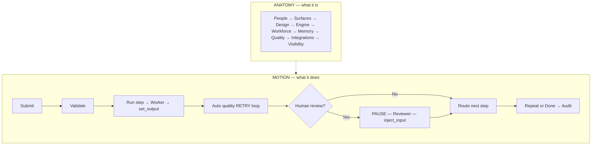


---

*Document version: 2026-06-14 · EngineX complete guide · Maps business language to `core/engine/` codebase.*