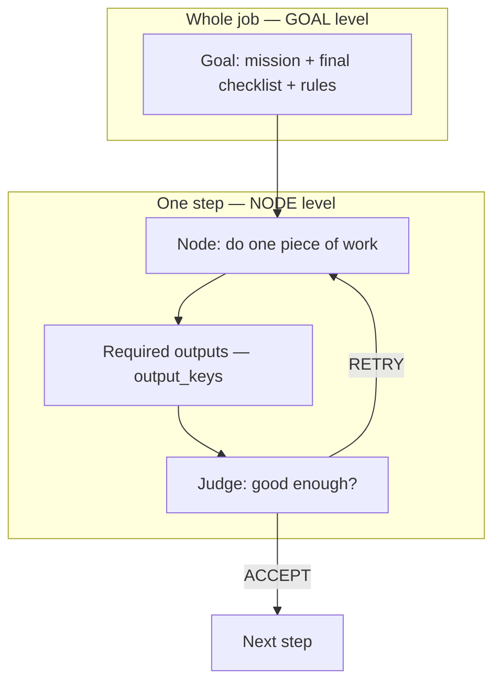
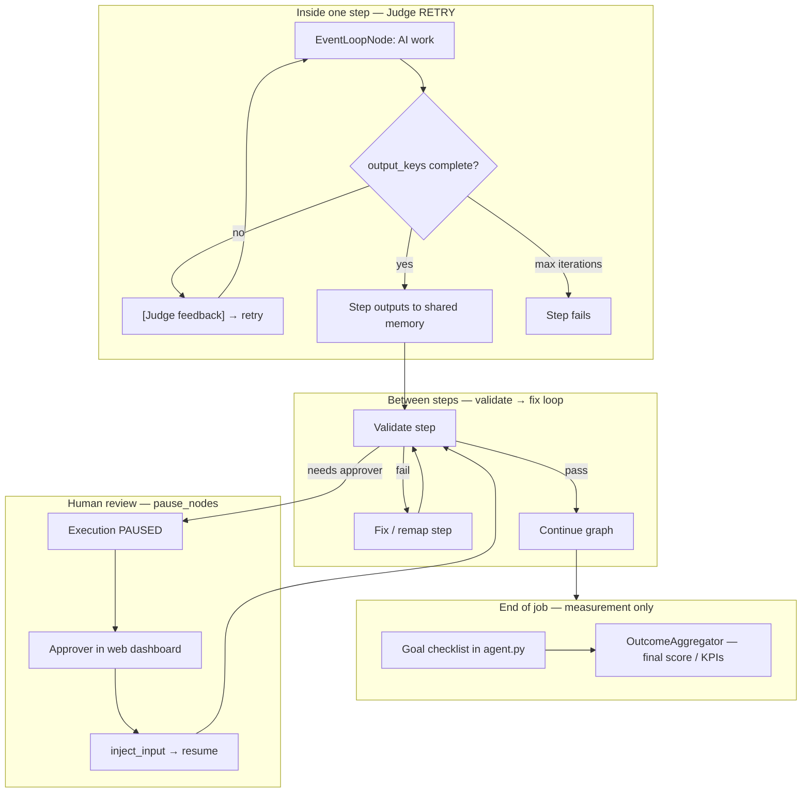
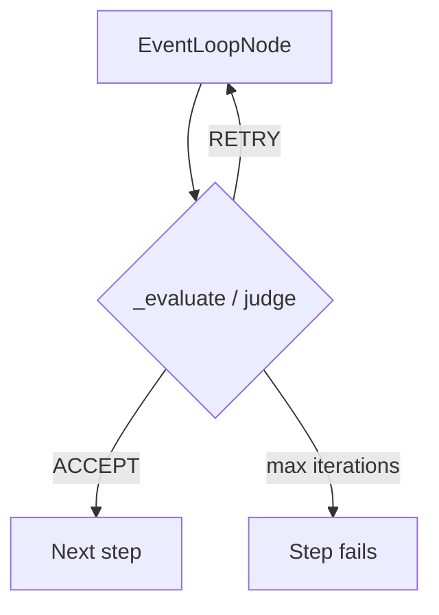

# Goals, Nodes, and Feedback Mechanisms

How EngineX evaluates success at each layer — and how auto-correction, graph loops, and human review fit together.

**Related:** [ENGINEX_COMPLETE_GUIDE.md](ENGINEX_COMPLETE_GUIDE.md) §6–8 · GitHub [#10](https://github.com/EngineXV/engineX/issues/10)

---

## Conceptual model

Think of an agent as a factory line:

| Layer | Role |
|-------|------|
| **Goal** | Final QA on the finished product |
| **Each step (node)** | One station on the line |
| **Judge RETRY** | Same station sends work back to the AI to fix |
| **Graph loop** | Route to a fix step, then back to validation |
| **Human review** | Person must sign off before the line continues (`pause_nodes`) |

---

## Common misconceptions

| Misconception | Actual behavior |
|---------------|-----------------|
| Every node has its own success criteria list | Usually **no** — checklist is on the **Goal** in `agent.py` |
| Goal criteria auto-retry the whole agent | **No** — they score/report at the end only |
| ESCALATE = send to human | **No** — human review = **`pause_nodes`** |
| Node criteria = Goal criteria | **Different layers** (see below) |

---

## The three layers

### Layer 1 — Goal (whole job checklist)

- **Where:** `examples/templates/<agent>/agent.py`
- **Code:** `core/engine/graph/goal.py`, `core/engine/runtime/outcome_aggregator.py`
- **Role:** Final evaluation — not the retry mechanism for individual steps

### Layer 2 — Node outputs (did this step finish?)

- **Where:** `NodeSpec.output_keys` in `nodes/__init__.py`
- **Behavior:** Missing output → **Judge RETRY** → AI tries again (limit: `loop_config.max_iterations`)
- **Code:** `core/engine/graph/event_loop/node.py` → `_evaluate()`

### Layer 3 — Node success_criteria (optional quality rubric)

- **Where:** optional `NodeSpec.success_criteria`
- **Behavior:** Second LLM quality check via `conversation_judge.py`
- **Examples:** `meeting_scheduler`, `agreement_analysis`, `deep_research`

---

## All four feedback mechanisms

---

## Retry vs human review

| Mechanism | Who acts | When |
|-----------|----------|------|
| Judge RETRY | AI, same step | Missing outputs |
| Graph loop | Another step | validate → fix edges |
| Human pause | Person in dashboard | `pause_nodes` / approval |
| Goal criteria | Measurement only | End of run / KPIs |

**ESCALATE** (judge) = step fails. Not equivalent to human review.

---

## Auto-correction — existing implementation

| Capability | Code location |
|------------|---------------|
| Step judge (missing `output_keys` → RETRY) | `event_loop/node.py` → `_evaluate()` |
| Feedback to LLM on retry | `[Judge feedback]: ...` via `add_user_message()` |
| Optional Level 2 quality judge | `conversation_judge.py` + `success_criteria` |
| Per-step retry limit | `loop_config.max_iterations` |
| Between-step loops (validate → fix) | Conditional `EdgeSpec` in `graph/edge.py` |
| Retry telemetry (partial) | `ExecutionResult.total_retries`, runtime logs |
| Whole-job Goal scorecard | `OutcomeAggregator` — tracks only, no full-agent auto-retry |

There is no separate `EvaluationNode` — the judge runs inside each event_loop step.

---

## Reference templates

| Template | Pattern |
|----------|---------|
| `agreement_analysis` | HITL + judge RETRY on extract |
| `deep_research` | Research loop + HITL at review/report |
| `log_monitor` | Timer + conditional edges + human review |
| `hourly_tracking` | validate → fix loop + HITL for unresolved exceptions |
| `support_triage` | HITL-only demo (no graph loop) |

---

## Tests

Retry behavior is covered in `core/tests/test_event_loop_node.py` and related event-loop tests:

- RETRY when `output_keys` missing
- Max iterations exhausted → step fails cleanly
- Feedback injected into conversation on RETRY

Improvement gaps and platform notes: [ENGINEX_COMPLETE_GUIDE.md](ENGINEX_COMPLETE_GUIDE.md) §22.
