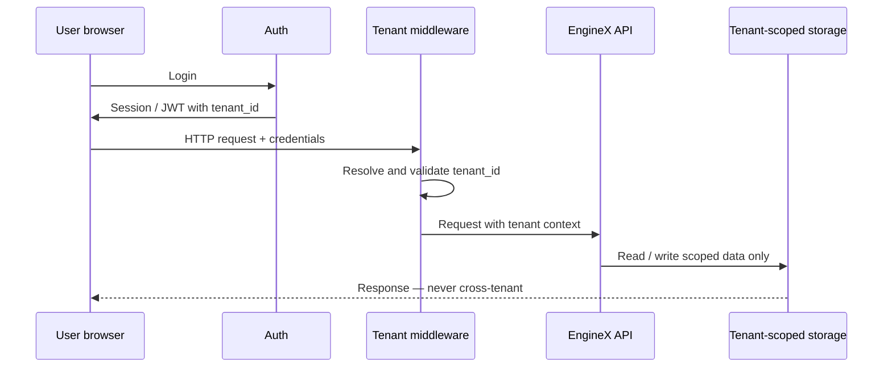
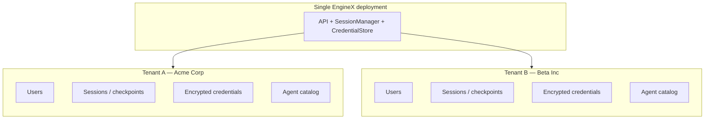

# Multi-Tenant Architecture (Design)

**Status:** Phase 2 — not implemented in EngineX OSS today.  
**GitHub:** [#4 Multi-Tenant Architecture](https://github.com/EngineXV/engineX/issues/4)

EngineX OSS is **single-tenant**: one install, one client, data under `~/.engine/`. Early pilots should use a **dedicated EngineX install per client** in their VPC ([CLIENT_DEPLOYMENT_GUIDE.md](CLIENT_DEPLOYMENT_GUIDE.md)). Multi-tenant SaaS is a future platform capability — typically delivered via **Engine Cloud** (private control plane), not the public OSS repo.

---

## Why multi-tenant matters

- Enables SaaS deployment (recurring revenue, faster onboarding)
- Single infrastructure stack serves multiple customers
- Required for enterprise self-service signup
- Tenant isolation failures are security incidents — must be tested rigorously

---

## Current state (OSS)

| Area | Today | Required change |
|------|-------|-----------------|
| HTTP API | `./engine serve` — no authentication | Auth + tenant context on every request |
| Sessions | In-memory `SessionManager` | Scoped by `tenant_id`, persisted |
| Storage | Files on disk (`~/.engine/` JSON — **no database**) | Tenant-prefixed paths or database |
| Credentials | Global `~/.engine/credentials/` | Per-tenant encrypted vault |
| Agents | Shared repo templates | Per-tenant agent catalog |
| Users | None | Organization, user, roles |
| Frontend | Single workspace | Login + tenant-scoped API |

**Key files (future work):** `core/engine/server/`, `core/engine/storage/`, `core/engine/credentials/`, `core/frontend/`

---

## Personas

| Persona | Access |
|---------|--------|
| **Tenant admin** | Manage users, credentials, agents for their organization |
| **Operator / approver** | Run workflows, approve in browser |
| **Platform admin** | Create tenants, monitor health |
| **Builder** | Deploy agent packages into tenant workspace |

Primary user interface: **web dashboard** (not desktop — see [#5 Desktop](https://github.com/EngineXV/engineX/issues/5)).

---

## Phased delivery

### MVP — Tenant isolation core

Goal: Two test tenants; Tenant A cannot read Tenant B data.

- Data model: `Organization`, `User`, `Membership`, `Role`
- Login (email/password or OIDC for MVP)
- Tenant middleware on all API routes
- Scope sessions, credentials, storage by `tenant_id`
- Frontend login + tenant-scoped API calls
- Cross-tenant security tests (required)

### Phase 2 — Tenant workspaces

- Per-tenant agent catalog
- Per-tenant LLM/model settings
- Per-tenant MCP / skills config
- Audit log (runs, credential access, approvals)

### Phase 3 — Enterprise

- SSO/SAML, SCIM provisioning
- Billing / usage quotas
- GDPR export/delete, data residency

---

## Non-goals (MVP)

- Billing, multi-region, custom domains per tenant
- Replacing per-customer dedicated deployment (valid GTM before this ships)

---

## Request flow (auth + tenant context)

---

## Data isolation

**Rule:** `tenant_id` on every session, credential, and storage path. Cross-tenant access attempts must fail and be covered by automated tests.

---

## Open questions

1. Postgres vs filesystem for tenant/user storage in MVP?
2. Auth provider: built-in vs Auth0 / Clerk / Keycloak?
3. Agent delivery: git import, zip upload, or registry?
4. One supervisor per tenant or shared platform supervisor?

---

## Definition of done (MVP)

- Two or more tenants operate independently on one deployment
- Users access only their tenant's data
- All APIs enforce tenant isolation — verified by automated tests
- Frontend requires authentication
- Security review completed before merge

This document is the design spec; implementation tracking lives in GitHub #4.
